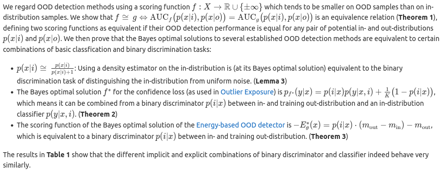
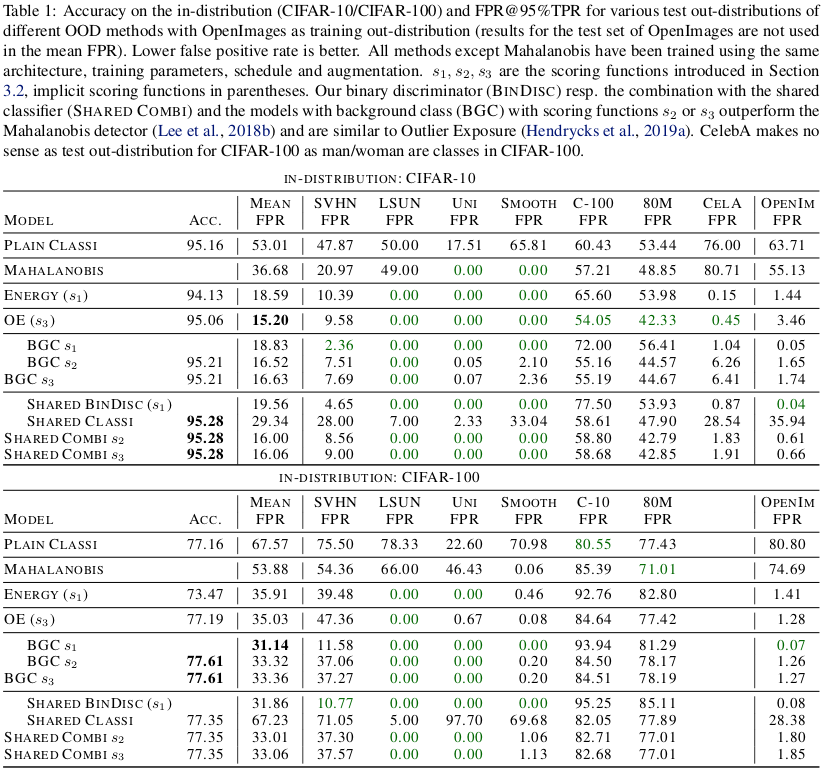

Code for the ICML 2022 paper 
# [Breaking Down Out-of-Distribution Detection: Many Methods Based on OOD Training Data Estimate a Combination of the Same Core Quantities](https://arxiv.org/abs/2206.09880)

**Julian Bitterwolf, Alexander Meinke, Max Augustin and Matthias Hein**

**University of Tübingen**

**[https://arxiv.org/abs/2206.09880](https://arxiv.org/abs/2206.09880)**

## Paper Summary

## Training
For training new models, run the `train_ood_aware.py` script with the appropriate arguments.
For example, the shared classifier/binary discriminator for CIFAR-100 can be reproduced by running

`python train_ood_aware.py --dataset_in CIFAR100 --dataset_out OpenImages --gpu 0 --method SharedCD --save ./my_saves` .

## Evaluation
The models from Table 1 in the paper can be evaluated with

`python evaluate_ood_detection_methods.py --gpu 0 trained_models/eval_OpenImages.json` .

To evaluate other models, add them to a `.json` file with their location and relevant hyperparameters, if applicable.

## Setup
The paths in `utils/paths_config.py` need to be set to the locations of your datasets.

If a dataset is not available for evaluation, it will be skipped for the evaluation.

The code was tested with `Python 3.8.5`, `PyTorch 1.6.0` and `torchvision 0.7.0`.
